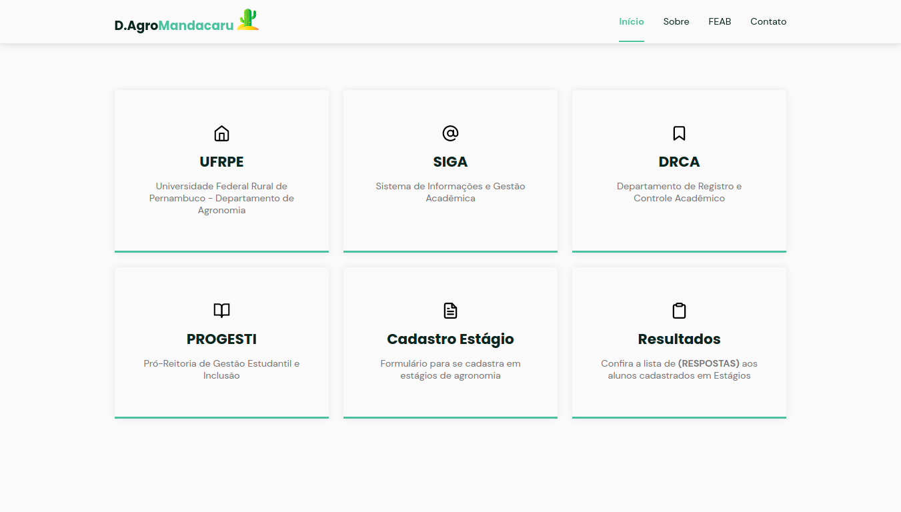

  <a href="#-tecnologias">Tecnologias</a>&nbsp;&nbsp;&nbsp;|&nbsp;&nbsp;&nbsp;
  <a href="#-projeto">Projeto</a>&nbsp;&nbsp;&nbsp;|&nbsp;&nbsp;&nbsp;
  <a href="#-connected">Connected</a>

 

  

## 💻 Tecnologias

- HTML
- CSS
- JavaScript

## 📝 Projeto

Carcará é um single-page, que resumo um pouco sobre a atual chapa do Diretório Acadêmico de Agronomia. Também reuni links de extrema utilidade aos calouros do curso.
